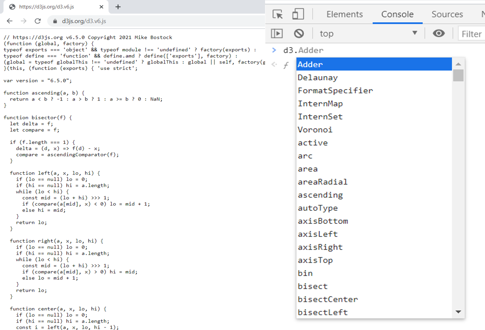

# Lesson 1 - D3 Introduction

## Outline
* Load D3
* D3 Selection
* D3 Chaining
* First Example
* Bar chart with divs

## Load D3

Create a file, name it `d3_1_1.html` with the following content:
``` html
<html>
    <head>
    </head>
    <body>
         <p>Hello World!</p>
    </body>
</html>
```
To load the D3 library, we must refer to the script source, being served locally or in a CDN. There are 2 versions of D3 simultaneously in every D3 iteration (d3.js and d3.min.js), the main one is better for development purposes, as it can output better error messages and allow navigation of source in-browser, the min version is a deploy version, smaller and usually faster. Alternatively, one can download all the [source repository](https://github.com/mbostock/d3/releases) to make with the source and see the examples. The latest version (10/03/2019) is 5.12.0 and all the lessons will be tested using this one.

To use D3 locally, download the d3.js script from the [D3 website](https://d3js.org/). Place the d3.js in your work directory and use this tag on the `<head>` of your html:

``` html
<script type="text/javascript" src="d3.js"></script>
```

To use the script without direct download:
``` html
<script type="text/javascript" src="https://d3js.org/d3.v5.js"></script>
```
Reload your page, and to verify the correct loading of the library one can use the developer's tools of the browser with `ctrl + shift + i` or `F12` (in Chrome). Choose the source tab and hover over the D3 link, then open a new tab on the browser with source code. Alternatively, on the console tab you can write `d3.` and expect the auto-complete shows available options. Both options can be seen in the following image:



## D3 Selection
The `d3.select()` function selects a DOM node of HTML using the CSS syntax, or `null` on case of non-existant node, and it returns only the first node found. More on CSS selectors [here](https://www.w3schools.com/cssref/css_selectors.asp).

Modify the _Hello_ in the HTML with the following code:
``` html 
<p class="p1" >Hello </p>
``` 
And using the console select the paragraph (`<p>` tag) with the following command:
``` javascript
let elem = d3.select(".p1")
```

Now it is possible to modify the style properties of the node using the command `style`. In the console verify and change the background color with the commands:
``` javascript
elem.style('background-color') // verify color
elem.style('background-color', '#990099') // change color
```

More on selection on the [docs](https://github.com/d3/d3/blob/master/API.md#selections-d3-selection).

## D3 Chaining 

Pay atention that `elem.style()` returns an array. Check that if this array is the same as `elem` using the `===` operator. Most D3 functions return its own selection, allowing chaining of operations. Using selections, change the text of paragraph to "Good morning World!" using the console.

## First Example
Create a new HTML file, with the following content:
``` html
<!DOCTYPE html>
<html lang="en">
    <head>
        <meta charset="utf-8">
        <title>First D3 Example</title>
        <script type="text/javascript" src="http://d3js.org/d3.v5.js"></script>
    </head>

    <body>
        <script type="text/javascript">
            d3.select("body")
                .append("p")
                .text("New paragraph!");
        </script>
    </body>

</html>
```

In this example D3 chaining is used to add a new paragraph. A alternative way to do the same operations is:
``` javascript
let body = d3.select("body");
let p = body.append("p");
p.text("New paragraph!");
``` 
Load this page and modify the code to add a new paragraph. The new paragraph must have a new color, use the `style` function and the `color` argument.

### Using data
Clear the script tag and use this code:
``` javascript
let dataset = [ 5, 10, 15, 20, 25 ];
		
d3.select("body").selectAll("p")
    .data(dataset)
    .enter()
    .append("p")
        .text("New paragraph!");
```

Now take some time to analyze the code. Pay atention to the dataset definition, and its binding with the paragraphs using the `enter` function. Add more elements to the dataset and see what happens.  
To access the array data you need to create a callback function on the element. Change the `text` function to this one with a callback and reload the page.
``` javascript
.text(function (d) {
    return "I can count up to " + d;
});
```

### Styling
Using the `style` function modify the code to bind the color with the array value, black for d <= 15 and red for d > 15. Modify the function used to generate the text and add what is needed. Style other attributes using the data, like the font-size and margin-left.(Note that some values need more than the numbers, it needs the metric too,like `font-size: 20px`).

## Bar chart with divs
For this final task of this lesson, we will create a bar chart using the `div` HTML tag. To guarantee that all bars are equal we will define a class and style it using CSS, that way all the divs will share the same set of attributes. The only difference between them will be the size. Add this CSS on the HTML.

``` css
<style type="text/css">
div.bar {
	display: inline-block;
	width: 20px;
	height: 75px; /* Overriden by D3-assigned height on script */
	margin-right: 2px;
	background-color: teal;
}
</style>
```

Now clear the script the D3 selections on the script and add this code:

``` javascript
d3.select("body").selectAll("div")
    .data(dataset)
    .enter()
    .append("div")
        .attr("class", "bar");
```

Analyze the result. To bind the height of the divs with the data a adjustment is necessary:
``` javascript
 .style("height", function(d) {
return d + "px";
});
```
Modify the scale (with a multiplicative factor) and the margin (`margin-right`) to make it more clear. Modify the data and see how it changes the chart automatically. Alternatively you can use code to generate data randomly:
``` javascript
let dataset = []; 
for (var i = 0; i < 25; i++) { 
    let newNumber = Math.random() * 30; 
    dataset.push(newNumber); 
}
```
Most of this last task can be seen on a Mike Bostock [page](https://bost.ocks.org/mike/bar/).