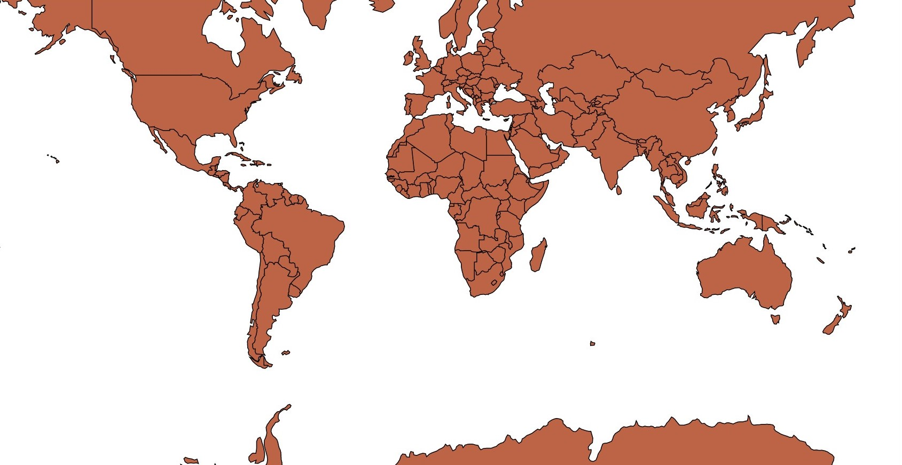
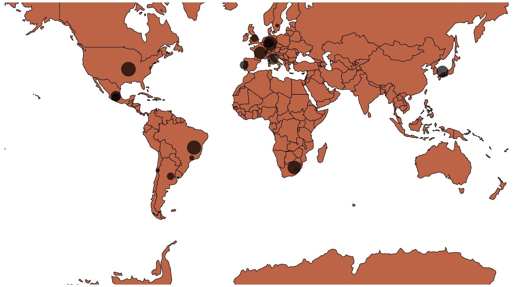

# Lesson 4 - Map Visualization and Nesting

## Outline
* GeoJSON
* Map Visualization
* Pre-Processing
* Nesting
* Grouping
* World Cup Visualization

## GeoJSON
Inspect the `D3_4_1_inspect_this.htm` file and analyze what it does. Add the `debugger` after the SVG line and oen it on Chrome to inspect the information loaded from the `world_countries.json`. Inspect the `geo_data` variable logged. More about the GeoJSON format [here](https://mygeodata.cloud/converter/geojson-to-latlong).

## Map Visualization
The json file will be used to visualize the polygons associated with the world countries. For this, we'll start selecting a projection:
``` javascript
let projection = d3.geoMercator();
```

The projections tranforms a `latitude,longitude` pair of points in the pixel coordinates display to the SVG element. Next we'll draw the polygons using the `path` element.
``` javascript
let path = d3.geoPath().projection(projection);
svg.append("path")
  	.attr("d", path(geo_data));
```
The `path` function returns a path of each country. Verify this with the `debugger` function after the path line and see what happens when the argument is a GeoJSON object (`path(geo_data.features[0]))`).  
Modify the scale and position of the map using the `transform` scale and translate functions in the mercator object. Adjust the scale to 170 (default scale value is 150, try woth values ranging between 100 and 500). Center the map in the middle of SVG.  
Modify the `fill`, `stroke` and `stroke-width` by your preferences. Using the `rgb(190,100,70)` and a 1 pixel black line one can obtain the following image:



Other projections are available to use, like the `geoEquirectangular`. More about projections [here](https://github.com/d3/d3-geo) and [here](https://d3indepth.com/geographic/).

## Pre-Processing
For this set of examples, we will visualize for each country how many people watched the World Cup on the year that happened there. Start loading the World Cup data in the `world-cup-geo.tsv` with the following code:
``` javascript
function plot_circles(data) {

}

d3.tsv("world-cup-geo.tsv")
	.then(plot_circles)
	.catch(err => { console.log(err) });
```

Finish the program inside the plot circles function or log the data on the console. Visualize the first line of the file (`console.table(data[0]);`) and see that all columns are string. You can extend the Promise return to pre-proces this data and convert it:
``` javascript
let parseTime = d3.timeParse("%d-%m-%Y (%H:%M h)");
            	
d3.tsv("world_cup_geo.tsv")
	.then((data) => {
		let newdata = data.map( d => {
			d["attendance"] = +d["attendance"];
			d["date"] = parseTime(d["date"]);
			return d;
		});
		plot_circles(newdata)
 	});
```

The `timeParse` function transforms the string in a `Date` object and the `+` signal casts to a float value. Reload the page and confirm the changes. More about time parsing [here](https://github.com/d3/d3-time-format/blob/master/README.md#locale_format).

## Nesting
To recover the total os spectators by year/world cup it is necessary reorder and group the data. The `nest` function transforms data in a hierarchical way by grouping it by a set of rules. This function has three blocks:
* key: data grouping criteria
* rollup: defines data agrregation rules
* entries: the data
Add the following code in the `plot_circles` function to use the year as data grouping criteria.
``` javascript
let nested = d3.nest()
	.key(function (d) {
		return d["date"].getUTCFullYear();
	})
	.rollup(function (leaves) {

	})
	.entries(data);
```
Log the `rollup` block and analyze the variable `d["date"].getUTCFullYear` and `leaves`. More about nesting [here](http://bl.ocks.org/phoebebright/raw/3176159/)

## Grouping
To sum all values of spectators in each year add the following code inside the rollup function:
``` javascript 
let total = d3.sum(leaves, function (d) {
		return d["attendance"];
	});
```
In each year the Wold Cup is held by different stadiums in a country, these stadium coordinates are on the defined on the file. Save them in an array with the following code:
``` javascript
let coords = leaves.map( d => projection([+d.long, +d.lat]));
```
Note that the map function return the array values after the projection transformation. With these values it is possiible to calculate the mean to position the circles representing the spectators quantity for each country.
``` javascript
let centerx = d3.mean(coords, d => d[0]);
let centery = d3.mean(coords, d => d[1]);
```
Finally we will create two new attributes to return on the rollup function, making it the total of spetactors and the position of the circle.
``` javascript
return { 
	"attendance" : +total,
	"x": centerX,
	"y": centerY
}
```
Use the `console.table(nested)` to see the values return by the function `nest` on the `nested` variable, and analyze the effects of this function on the data by checking the key and values.

## World Cup Visualization
Use a 5 pixel radius circle with the calculated coordinates in the map. Use the code from the last lesson, filling the blanks with the right values:
``` javascript
svg.append('g')
	.attr("class", "attendance")
	.selectAll("circle")
	.data(nested)
	.enter()
.append("circle")
	.attr("cx", function (d) { _____ })
	.attr("cy", function (d) { _____ })
	.attr("r", 5); 
```
### Visualizing the spectators 
Modify the code to bind the circle size with the total spectators from each country. You can use the followin excerpt:
``` javascript
let attendance_extent = d3.extent(nested, d => d.value["attendance"] );
let radius_scale = d3.scaleLinear()
	.domain(attendance_extent)
	.range([1,15]);
```
Apply the scale to the circle radius and reload the page. Is this scale the most appropriate? Why? What scale would make more sense? Try the `scaleSqrt` and compare both visualizations. Modify some features of the circles to see the overlay, like the opacity. At the end it must be something like this:


