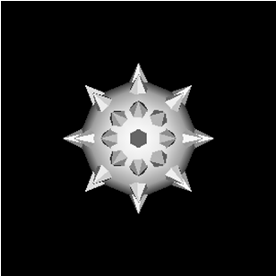
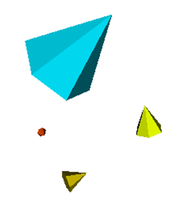

# Lesson 3 - Callbacks, Glyphing and Picking

## Outline
* Glyphing 
* Picking
* Unstructured Grid
* Scalar association to vectors and grids

# Glyphing
Glyphing is a form of visualization that represents data using geometric representations (glyphs).
The vtkGlyph3D class allows using this type of representation. To do so, the object needs an input (typically data with the various points where the Glyphs should be placed) and a source (which corresponds to the symbol to be placed at the various points).
Study the vtkGlyph 3D class and visualize a sphere with cones placed at each point of the sphere's polygonal model. You may adapt the following code.

``` html
glyph = vtkGlyph3D()
glyph.SetSourceConnection(coneSource.GetOutputPort())
glyph.SetInputConnection(sphereSource.GetOutputPort())
```

Explore and try to understand what  the SetScaleFactor and SetVectorModeToUseNormal methods are used fro? Try to replicate the following model.



Change modify the theta (SetThetaResolution) and Phi (SetPhiResolution) resolutions of the sphere. What do you observe?

# Object picking
Add a VtkPointPicker object to the interactor of the previous example to allow the selection of points of the model (use the setPicker method of the interactor). Associate a callback to this picker.
The Callback must show, in the command window, the coordinates of the selected point (use the GetPickPosition command of the vtkPointPicker object). 
Note that the picking action is predefined in VTK with the P key.
Finally add a sphere indicating the selected point. To do so, create an actor that represents the sphere, which will be passed to the callback and whose position will be updated according to the selected point (actor's SetPosition method).
Note: You may use the VisibilityOn/VisibilityOff methods so that the sphere is only visible after picking.

``` html
myPicker = vtkPointPicker()
mo1 = vtkMyCallback(myPicker)
myPicker.AddObserver(vtkCommand.EndPickEvent ,mo1)
...
iren.SetPicker(myPicker)
```

# Display of coordinates
Modify the CallBack (see last lecture) to show the point coordinates in the renderer next to the selected point. Use a textMapper and a vtkActor2D to visualize the coordinates of the selected point in the renderer.
To do so, modify the program as follows:

``` html
textMapper = vtkTextMapper()

textActor = vtkActor2D()
textActor.SetMapper(textMapper);
textActor.VisibilityOff();

ren1.AddActor( textActor );

mo1 = vtkMyCallback()
mo1.tMapper = textMapper;
mo1.tActor = textActor;
  
myPicker = vtkPointPicker()
	
myPicker.AddObserver(vtkCommand::EndPickEvent ,mo1)

iren.SetPicker(myPicker);
```

The pseudo code of your program should be:
* Test if the selection is valid (one possibility is to test the return of GetPointId()) – If the value is negative, the Actor becomes invisible.
* Get the selected point coordinate [3D] (GetPickPosition method)
* Get the coordinate of the selected pixel [2D] (GetSelectionPoint method). This coordinate is relative to the Viewport and represents a value in pixels.
* Update the TextMapper with the pixel coordinates (setInput)
* Update the TextActor position  (SetPosition)
* Make the actor visible.


Use the textMapper options to modify the format of the text used to display the coordinates (centered, with font courrier and bold).

# Unstructured Grid
Compile and analyze the program ugrid.py that creates and visualizes an unstructured grid with only one cell: a tetrahedra. Modify the code to display not a tetrahedron but separate vertices (cell type becomes VTK_VERTEX instead of VTK_TETRA). Modifye the properties of the actor to see the results (UgridActor.GetProperty().SetColor(1,0,0) and UgridActor.GetProperty().SetPointSize(5)).


# Scalar association to vectors and grids
Defines an object of type vtkFloatArray with three components (use the SetNumberOfComponents method to define the number of components). This array will contain the vectorial information to be associated with each vertex of the unstructured grid. Use the InsertTuple3 method to fill the vtkFloatArray with the coordinates of the vectors to be associated with each point (Associate the following vectors to the 4 points (1,0,0) (0,1,0) (0,0,1) and (1,1,1) ).
Associate the vectors defined in the vtkFloatArray to the points using the SetVectors method. (ugrid.GetPointData().SetVectors(your_array))
Create a cone and use the vtkGlyph3D class to display a cone oriented according to the associated vector at each vertex (see Lecture 3).

Now associate a scalar between 0 and 1 to each point of the grid, for that create another instance of type vtkFloatArray with a single component and use the setScalars method to associate a value to each point (dataSet.GetPointData().SetScalars(your_array )). 
Associate the following values ​​to the 4 points: 0.1 0.3 0.5 and 0.8. 
Run the code and notice how the scalar value is automatically used to modify the color of the various cones.
Search for the vtkGlyph3D class methods that allow you to turn orientation and scaling on and off and observe the various results.



# HedgeHog
VTK has a class for displaying vector information in the form of line segments. Analyze the vtkHedgeHog class and try to visualize the vector data from the previous exercize using this vtkhedgeHog class instead of the vtkGlyph3D.