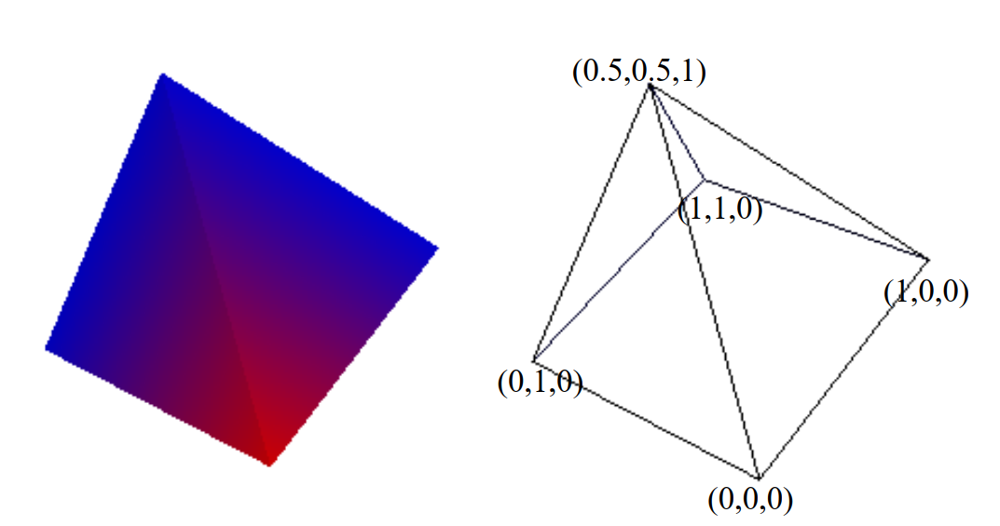
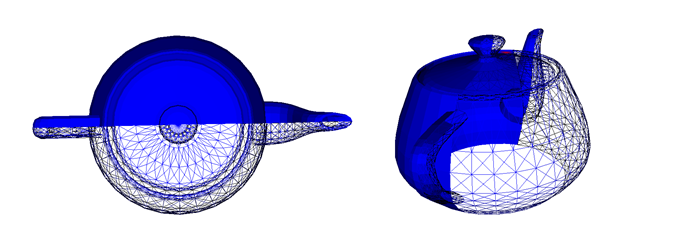

# Lesson 4 - Visualization techniques

## Outline
* 3D widgets
* Polygonal data
* Clipping of a polygonal model
* Scalar and vectors association unstructured grids


# 3D widgets
The interactors used so far are used to react to mouse and keyboard events, but have no physical representation in the scene.
In some cases it is important to be able to interact with objects directly exsting in the scene, for example to select a cutting plane. Widgets (Windows Objects) allow this type of interaction. Several widgets are available in VTK: vtkLineWidget, vtkPlaneWidget, vtkImplicitPlaneWidget, vtkBoxWidget, vtkImagePlaneWidget, vtkSphereWidget, vtkSplineWidget.
 

To use a widget, several steps are required:
* 1. Instantiate the Widget
* 2. Specify the vtkRenderWindowInteractor to observe (SetInteractor method)
* 3. Define the necessary callbacks associated to the Widget. Widgets have the following associated events: StartInteractionEvent, InteractionEvent, and EndInteractionEvent.
* 4. Most widgets also need to be placed in a certain position in the scene. For that, it is necessary to specify an instance of the vtkProp3D type or a specific position and then invoke the PlaceWidget() method.
* 5. Finally the Widget has to be activated. By default, the i key is used to activate the Widget.

Compile and test the program widget.py which is a possible solution to the display of coordinate discussed in  lesson 3.

Add a vtkImplicitPlaneWidget to to interact with the scene.
At this stage, it is not necessary to define any callbacks, just instantiate and place the plane in the scene. Do not forget to place the widget in the scene (PlaceWidget method) and to associate an interactor to it (SetInteractor method)

Activate the Widget using the I key and try to understand the different types of interaction available.

Using the methods of the vtkImplicitPlaneWidget class, modify the plane so that it appears at the point (1,1,1) and is normal to the X axis.

# Implicit functions and contouring
<!-- Compile and test the program implicit.py to visualize 5 contours from a quadric function defined with an implicit function.
Modify the number of contours to display 10 contours instead of 5 (to do so, it is necessary to change the parameters of the GenerateValues ​​function).
Change the sampling volume to a cube centered at the origin and dimension 4 in all directions. What do you  observe (you may see the vtkSampleFunction class documentation). Test further with a sampling volume between 0 and 2 in all directions.
Can you understand which is the defined quadric? what is its equation?

Modify the code to visualize an hyperbolic paraboloid with equation

$x^2-y^2-z=0$

Start by visualizing 5 contours between 0 and 1.2 as in the example provided. Now change the code to display only the curve corresponding to level 0 (you can use the SetValue function instead of GenerateValues). -->

# Polygonal Data
Compile and analyze the program poligonal.py that creates and visualizes a cube by creating an object of type vtkPolyData (this is an alternative of using te class vtkCubeSource).

Modify the code to create the following object.


# Cliping of a polygonal object
Use the vtkVRMLImporter class to view the Teapot.wrl file. You can use the code example below.

``` html
importer = vtkVRMLImporter()
importer.SetRenderWindow(renWin)
importer.SetFileName(".//#04//teapot.wrl")
import.Read()
``` 

Note that vtkimporter already has an associated renderer (in addition to geometry, lights and other scene properties are also imported), so it is not necessary to create a renderer to view the scene, just a window.

The vtkClipPolyData class allows “cutting” a polygonal model according to a clipping function.
Modify the program to clip the Teapot with a plane. The Clipping Output will have to be viewed in Surface mode, while the rest of the model (GetClippedOutput) will have to be viewed in WireFrame mode. The clipping function to be used can be created with the vtkPlane class which manages the implicit function of a plane. Do not forget to activate the option to generate clippedOutput().
Note that the input of the vtkClipPolyData object must be an object of type vtkPolyData. in this example, the model is encapsulated inside the importer renderer and can be accessed with the following code

``` html
model = importer.GetRenderer().GetActors().GetLastActor().GetMapper().GetInput()
```

Opcional:
Now, modify the program to cut the model interactively by manipultaing the cutting plane. To do so, associate a callback to a vtkImplicitPlaneWidget. The implicit function (vtkPlane) will be updated using the getPlane() method of the vtkImplicitPlaneWidget. 
# dar mais info e agum código


# Scalar association to vectors and grids
Compile and teste the tetrahedra.py program. Modify the code to display not a tetrahedron but separate vertices (cell type becomes VTK_VERTEX instead of VTK_TETRA)
Defines an object of type vtkFloatArray with three components (use the SetNumberOfComponents method to define the number of components). This array will contain the vectorial information to be associated with each vertex of the unstructured grid. Use the InsertTuple3 method to fill the vtkFloatArray with the coordinates of the vectors to be associated with each point (Associate the following vectors to the 4 points (1,0,0) (0,1,0) (0,0,1) and (1,1,1) ).
Associate the vectors defined in the vtkFloatArray to the points using the SetVectors method. (dataSet.GetPointData().SetVectors(your_array))
Create a cone and use the vtkGlyph3D class to display a cone oriented according to the associated vector at each vertex.

Now associate a scalar between 0 and 1 to each point of the grid, for that create another instance of type vtkFloatArray with a single component and use the setScalars method to associate a value to each point (dataSet.GetPointData().SetScalars(your_array )). 
Associate the following values ​​to the 4 points: 0.1 0.3 0.5 and 0.8. 
Run the code and notice how the scalar value is automatically used to modify the color of the various cones.
Search for the vtkGlyph3D class methods that allow you to turn orientation and scaling on and off and observe the various results.


# HedgeHog
VTK has a class for displaying vector information in the form of line segments. Analyze the vtkHedgeHog class and try to visualize the vector data from the previous exercize using this vtkhedgeHog class instead of the vtkGlyph3D.